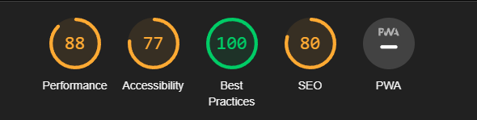
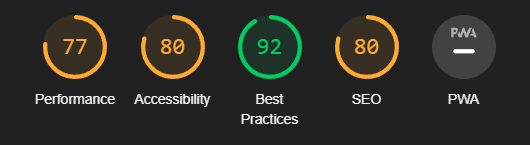

# about-me

## **Lab: "About Me" project**

*An “About Me” webpage that quizzes the user on fun facts and gives the user some basic information about who I am and where I came from.*

*Lab: “About Me” project
Read the document, in its entirety, before beginning your lab.*

### *Problem Domain*

*Teach us more about you! Build out an “About Me” webpage that quizzes the user on fun facts gives the user some basic information about who you are and where you came from. We will build onto this project over the next few labs. Be prepared to refactor your code each day and learn about how a web site incrementally goes from an idea to a deployed site through various iterations of development.*

### *User Stories*

*This is our first exposure to user stories. User stories are a device commonly used in software development to identify what the functionality and design of a product should be by considering the interests and motivations of people with varied multiple points of view. They are presented in the manner of*

`As a __, I want __, so that____`

*This layout allows a client to communicate to a team what type of behavior they are looking for and allow the developer team to think up a solution that best fits the the clients need.*

*The development team will then create sub-bullets called Feature Tasks which are individual tasks that must be completed by the developer to accomplish the user story. Once all of the feature tasks for an individual user story is completed, so is the story.*

*Below are your lab requirements in this format with the feature tasks already created.*

### Developer Style Guide

*A style guide is a series of standards and practices that must be followed in order for your code to be accepted by the team. This can include variable naming, file structure, and process. Below is a list of practices that you will be required to follow within this lab:*

    - Your JS file must contain a `use strict` declaration at the top, and your javascript file must be linked in your html file as an external script file.

    - Make sure that all code is cleanly written with correct indentation and syntax. Look at an example JavaScript Style Guide. Note that your JS must pass the rules in the linter that you installed.

    - Follow the Add, Commit, Push process. It should be evident in GitHub that commits are made regularly, and with good commit messages that explain the WHY of the commit.

### Stretch Goals

*After completing all of the requirements listed above, you may optionally challenge yourself further by implementing some or all of the following into your application.*

    - Push yourself in your CSS work. Experiment, try some layout feature or technique that you have not tried before (maybe a sticky header or sticky footer, icon fonts such as FontAwesome, etc.) or just try to refine your layout/style as much as possible.

### Resources

*Review and utilize these resources when working with your lab.*

    - Follow the instructions in the “Setting Up a New Code 201 Project” document for an overview of the content that is required for your lab repo.

- Report for Class 2:

- Report for Class 3:

